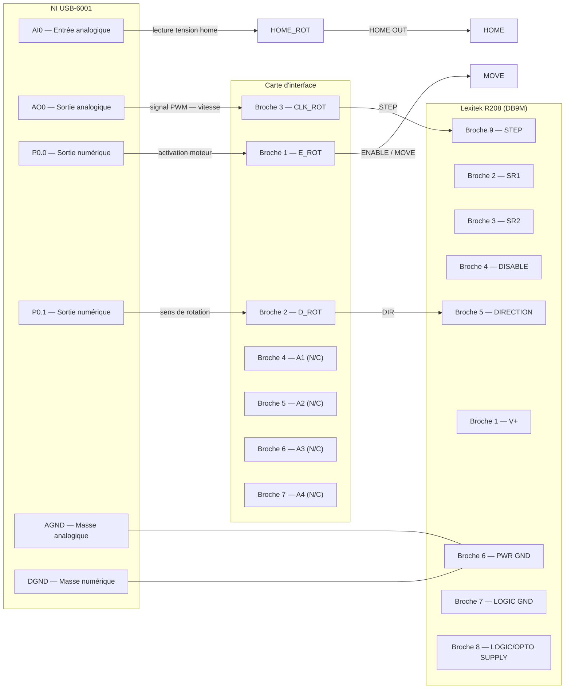

# Documentation — Platine de rotation Lexitek R208

## Présentation

La **Lexitek R208** est une platine de rotation motorisée (moteur pas-à-pas) pilotée via un connecteur **DB9M**.  
Elle est interfacée ici avec une carte d'acquisition **National Instruments USB-6001** via une **carte d'interface**.

---

## Connecteur DB9M — Lexitek R208

| Broche DB9 | Nom du signal        | Direction       | Description                                              |
|:----------:|:--------------------:|:---------------:|:---------------------------------------------------------|
| 1          | V+                   | Entrée (R208)   | Alimentation moteur 12–24V DC                           |
| 2          | SR1                  | Entrée (R208)   | Référence de vitesse 1 (Opto-isolé)                     |
| 3          | SR2                  | Entrée (R208)   | Référence de vitesse 2 (Opto-isolé)                     |
| 4          | DISABLE              | Entrée (R208)   | Désactivation moteur — actif LOW (Opto-isolé)           |
| 5          | DIRECTION            | Entrée (R208)   | Sens de rotation (Opto-isolé)                           |
| 6          | PWR GND              | —               | Masse puissance                                         |
| 7          | LOGIC GND            | —               | Masse logique                                           |
| 8          | LOGIC/OPTO SUPPLY    | Entrée (R208)   | Alimentation logique / opto 5–24V DC                    |
| 9          | STEP                 | Entrée (R208)   | Impulsion de pas — fréquence = vitesse (Opto-isolé)     |

> ⚠️ La broche **DISABLE (Pin 4)** est à **logique inversée** : LOW = moteur actif, HIGH = moteur désactivé.  
> ⚠️ Aucun signal **HOME OUT** n'est présent sur ce connecteur. Le capteur de position origine doit être câblé séparément.

---

## Connecteur Carte interface — RotationTableAdaptor (REV/A)

| Broche DB9 | Nom du signal        | Direction            | Description                                              |
|:----------:|:--------------------:|:--------------------:|:---------------------------------------------------------|
| 1          | E_ROT                | Entrée (R208)        | Désactivation moteur                                    |
| 2          | D_ROT                | Entrée (R208)        | Sens de rotation                                        |
| 3          | CLK_ROT              | Entrée (R208)        | Impulsion de pas — fréquence = vitesse                  |
| 4          | HOME_ROT             | Sortie (OPB941W51)   | Information position origine (0v = home)                |

> ⚠️ Les entrées logique CMOS 3.3V de la carte d'adaptation attaquent des transistors MOSFET VN10LF qui ont
des sorties à collecteurs ouverts qui pilotent les signaux d'entrée du R208.

---

## Schéma de câblage — NI USB-6001 ↔ Carte d'interface ↔ Lexitek R208

---

## Correspondance broches — `hardwareControl.h`

| Constante dans le code | Type de pin NI USB-6001 | Broche NI | Carte d'interface | Signal R208 (DB9M) | Description                          |
|:-----------------------:|:------------------------:|:---------:|:-----------------:|:-----------------:|:-------------------------------------|
| `HOME_PIN { 0 }`        | `analog_pin` (AI0)       | AI0       | NA          | Broche 5          | Lecture de la position origine       |
| `CLOCK_PIN { 0 }`       | `analog_pin_continuous` (AO0) | AO0  | Broche 3          | Broche 9          | Signal PWM — contrôle de la vitesse  |
| `MOVE_PIN { 0 }`        | `digital_pin` (P0.0)     | P0.0      | Broche 1          | Broche 4          | Activation / arrêt du moteur         |
| `DIR_PIN { 1 }`         | `digital_pin` (P0.1)     | P0.1      | Broche 2          | Broche 5          | Sens de rotation                     |

---

## Logique de contrôle

| Signal     | Valeur    | Effet                          |
|:----------:|:---------:|:-------------------------------|
| `DIR_PIN`  | `HIGH`    | Rotation **horaire**           |
| `DIR_PIN`  | `LOW`     | Rotation **anti-horaire**      |
| `MOVE_PIN` | `HIGH`    | Moteur **activé**              |
| `MOVE_PIN` | `LOW`     | Moteur **désactivé**           |
| `CLOCK_PIN`| fréquence | Vitesse en Hz (max : 2000 Hz)  |
| `HOME_PIN` | tension   | Détection position origine     |
